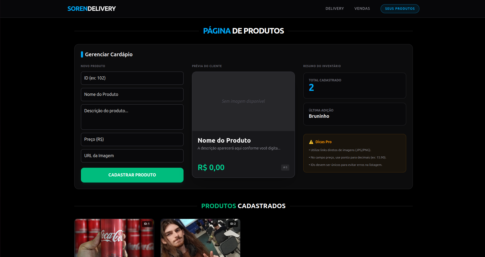

# 🍔 Soren Delivery - Sistema de Gastronomia

Este é um sistema completo de gerenciamento de pedidos de delivery, desenvolvido para facilitar a conexão entre comércios gastronômicos e seus clientes.

---

## 🚀 Funcionalidades
- [x] Cadastro de Produtos (Admin)
- [x] Listagem de Itens (Admin)
- [ ] Gerenciamento de vendas (Admin)
- [ ] Catálogo de produtos (Em breve)
- [ ] Carrinho de Compras (Em breve)
- [ ] Finalização de Pedido (Em breve)

## 🛠️ Tecnologias Utilizadas
- **React** (Biblioteca principal)
- **TypeScript** (Tipagem para evitar erros)
- **Vite** (Build tool ultra rápida)
- **CSS Modules** (Estilização organizada)

## 📸 Demonstração

## 📦 Como rodar o projeto
1. Clone o repositório:
   `git clone https://github.com/Soren-bhs/projeto-delivery.git`
2. Instale as dependências:
   `npm install`
3. Inicie o servidor de desenvolvimento:
   `npm run dev`